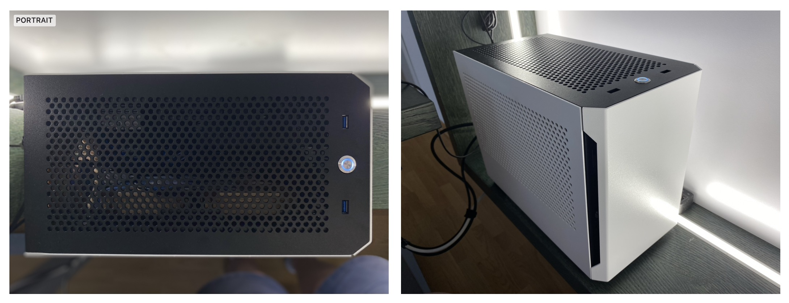
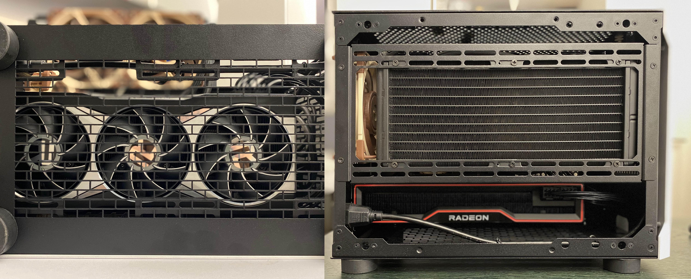
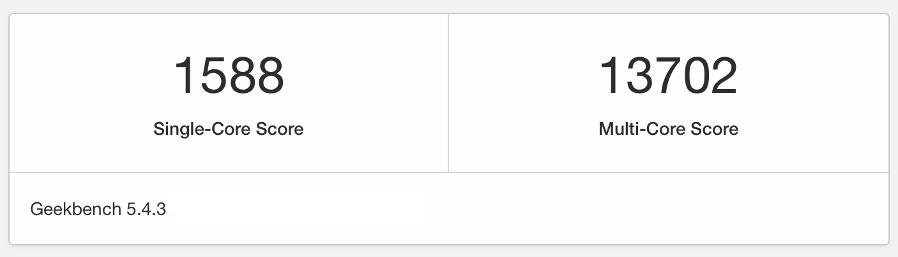
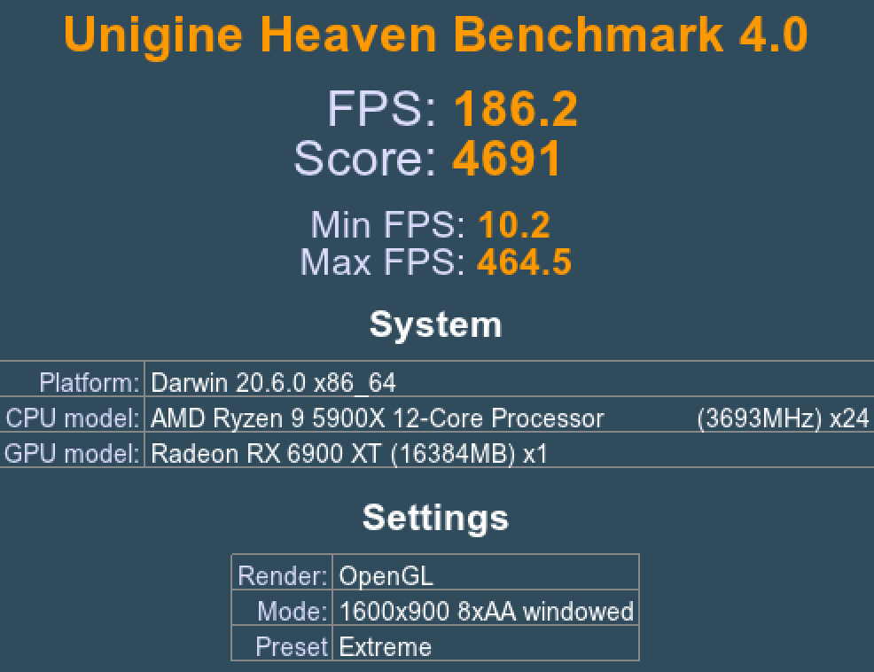

# Gigabyte B550I Aorus Pro AX + Ryzen 9 5900X + RX 6900 XT

- OpenCore ver 0.7.5
- MacPro7,1








Current macOS:

- Bug Sur 11.6.1

## Current hardware

- AMD [Ryzen 9 5900X](https://www.amd.com/en/products/cpu/amd-ryzen-9-5900x) CPU
- XPG [Levante 240](https://www.xpg.com/en/feature/644/) AIO
- [Gigabyte B550I Aorus Pro AX](https://www.gigabyte.com/Motherboard/B550I-AORUS-PRO-AX-rev-10/) motherboard (rev 1.0)
- AMD [RX 6900 XT](https://www.amd.com/en/products/graphics/amd-radeon-rx-6900-xt) graphics card
- Corsair [Vengeance LPX](https://www.corsair.com/ww/en/Categories/Products/Memory/VENGEANCE-LPX/p/CMK32GX4M2B3200C16) 32 GB (2 x 16 GB) DDR4 3200MHz CL16
- Corsair [SF750 Platinum](https://www.corsair.com/us/en/Categories/Products/Power-Supply-Units/Power-Supply-Units-Advanced/SF-Series/p/CP-9020186-NA) SFX PSU
- Noctua [NF-A12x25](https://noctua.at/en/products/fan/nf-a12x25-pwm) case fan
- ADATA [XPG 8200 Pro](https://www.xpg.com/us/feature/583/) 1TB NVMe SSD
- Samsung [860 EVO](https://www.samsung.com/us/computing/memory-storage/solid-state-drives/ssd-860-evo-2-5--sata-iii-500gb-mz-76e500b-am/) 500 GB 2.5in SSD
- Sliger [S620](https://sliger.com/products/cases/s620/) SFF case

### WiFI / Bt

The combo below offers natively supported WiFi 5 / Bluetooth 4.

- 1750Mbps Dual Band WiFi 2.4GHz/5GHz / Bluetooth 4.0 [Broadcom BCM94360CD](https://www.aliexpress.com/item/1750Mbps-Dual-Band-WiFi-Bluetooth-Card-2-4GHz-5GHz-BT-4-0-Broadcom-BCM94360CD-Wireless-Module/32974196141.html) card
- mini PCIe [adapter card](https://www.aliexpress.com/item/MINI-PCI-E-Adapter-Converter-to-wireless-wifi-card-BCM94360CD-BCM94331CD-BCM94360CS-BCM94360CS2-module-for-macbook/32256494722.html)

Combined with this riser cable, the card/adapter combo from above can be moved outside the motherboard I/O shroud, instead of existing Intel AX200 card.

- Mini [PCIe riser with adapter](https://www.aliexpress.com/item/BCM94360CD-BCM94360CS2-BCM943224PCIEBT2-Card-To-M-2-Key-A-E-Cable-For-Mac-OS-and-and/4000286967003.html) for M.2 Key A/E

### BIOS

Version F12

- Fast Boot: `Disabled`
- CSM: `Disabled`
- Above 4G Decoding: `Enabled`
- Resizable Bar Support: `Enabled`
- PCIe slot speed: `Auto`
- XMP Profile activated

## Usage

1. [Update `PlatformInfo/Generic` stuff](https://dortania.github.io/OpenCore-Post-Install/universal/iservices.html#generate-a-new-serial) with your own, inside `config.plist`
2. Use your Ethernet’s MAC address for `ROM` value, as explained in the Dortania guide. Don’t leave it as all 0s.
3. Update value of `brcmfx-country` argument in `NVRAM/7C436110-AB2A-4BBB-A880-FE41995C9F82/boot-args` with your country code. Should be identical or compatible with what your WiFi router is broadcasting. (Remove the parameter if you don’t know what I’m talking about here.)
4. Turn off Power Nap in Energy Saver.

### What’s working

Everything.

- CPU Power Management.
- NVMe and 2.5in SSD.
- WiFi, Bluetooth, Ethernet.
- All USB ports (without map, just with RHUB reset).
- Radeon GPU is natively supported.
- 4K HDMI or DisplayPort with HDR.
- Watch unlock, Handoff, iMessage, iCloud, Keychain, Xcode etc.
- System Integrity Protection (SIP) fully enabled.
- Sleep / Wake.

#### Media & DRM

This build is not using WhateverGreen and without it some media content seem to play just fine: Netflix in Safari, iTunes media, VideoProc options show everything hw-accelerated.

Plex locks up the machine on startup. TV+ content shows green screen.

Just loading WEG black-screens the boot process, soon after Apple logo appears. I don’t care about DRM on this build thus did not yet look into this.

I suspect that adding WhateverGreen.kext and `unfairgva` as [device property for GPU](https://forum.amd-osx.com/index.php?threads/fixing-green-screen-drm-on-bigsur-for-appletv-and-apple-music-streaming.1476/), would fix that too but this machine would likely need some ACPI renaming, since GFX0 does not exists – it’s called VGA:

```
% ./gfxutil -f GFX0 
DevicePath not found!

% ./gfxutil -f VGA 
09:00.0 1002:73bf /PCI0@0/GPP8@3,1/SWUS@0/SWDS@0/VGA@0 
= PciRoot(0x0)/Pci(0x3,0x1)/Pci(0x0,0x0)/Pci(0x0,0x0)/Pci(0x0,0x0)
```

I’ll deal with this when I get some free time.

### What’s not working

Sidecar most likely. Did not even try it but I suspect it does not work.

## Notes

Use at your own risk. 

- All `.efi` drivers and `.kext` are `-RELEASE` builds from the respective packages. 
- OpenCanopy (GUI boot menu) is up and running.
- I don’t boot Windows 10 using OC, thus I can’t guarantee it will work. I have Win 10 installed on separate SSD and switch using Boot Menu.

**Don’t ask me for help.** Sorry but this stuff is finicky and infuriatingly detailed that every little mis-step can be a proper headache. This is why [Dortania](https://dortania.github.io) advises to not reuse anyone’s EFI.  

Ask [on reddit](https://www.reddit.com/r/hackintosh/) and the [discord server](https://discord.gg/Wxam8aH).

Good luck.

## Give back

If you found this code useful, please consider [buying me a coffee](https://www.buymeacoffee.com/radianttap) or two. ☕️😋
